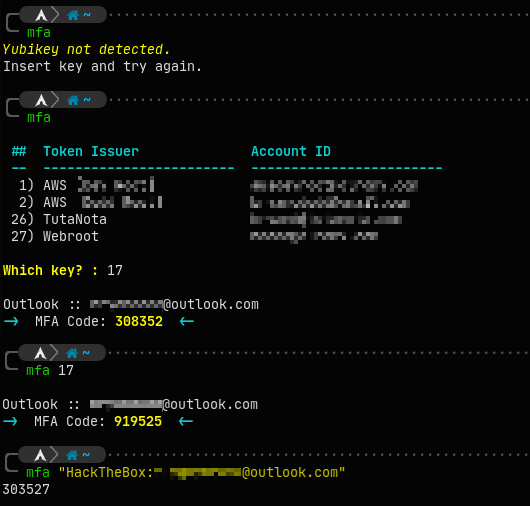

# Yubikey MFA via Terminal



This tool has four (4) modes of operation. It can be executed as a stand-alone script, or integrated into your shell profile. 
1. No parameter passed.
    * OATH keys will be read from Yubikey and you will be prompted to select the number of the key you want to capture. Code will be returned and its value copied to the system clipboard. 
2. Pass "list" as the only parameter.
    * OATH keys will be read from Yubikey. They will be numbered, but you will not be prompted to select a number, and no codes will be returned or copied to the clipboard.
3. Pass the number identifier for the key you're wanting.
    * The OATH code for the specified key will be returned and copied to system clipboard. 
4. Pass a string containing the name of the OATH key you're wanting.
    * If you provide a partial string, a match will be attempted but could fail if there are multiple possible selections each containing the string you provided. Potential matches will be returned allowing you to make a more specific request.
    * You can also choose to provide the entire Yubikey-Manager compliant string identifier: `<identity>:<account>`. This will always ensure a positive match if the key exists within the Yubikey you have inserted. 
    * Additional data about the OATH code is omitted from output - this means that only the OATH code itself is emitted and is therefore more suitable for use in programmatic applications.

> As written, this script is designed to be copied into your bash or zsh profile. Note the `mfa` alias defined on line 25.

## Dependencies
* [yubikey-manager](https://github.com/Yubico/yubikey-manager)

## Operational Settings
| Setting | Default | Note |
| ------- | ------- | ---- |
| `ykPasswordRequired` | `false` | Change to `true` if your Yubikey has been configured to require a password for OATH use. When `true`, `ykPasswordString` must also be supplied for proper operation. |
| `ykPasswordString` | `some-password` | Required when `ykPasswordRequired` is `true`. This value is a plain-text string of your Yubikey OATH password. |

## Configuration Settings
No additional settings available.

## Notes
* If your Yubikey is not inserted when the script is executed, or if your key is not detected for any other reason, you may see the message "Yubikey not detected." 
* If your OS distribution includes default aliases for the individual number characters (1 through 9, aliased to `cd -N`), the `unalias` commands may be necessary for the script to work properly by passing a number in as a parameter.
    * If you have aliases for the number characters that you must not change, prefix single digits with zero (i.e., instead of `5`, pass `05`).
* Tested and working with Yubikey OATH codes regardless of "touch" setting. If your code has been configured to require touch, prompts will appear on-screen as required and your Yubikey will begin to flash to indicate contact is required. Tap your key as usual and the value will be displayed on-screen and recorded to the system clipboard.
* If you have multiple keys loaded with very similar names, you may have to use the full OATH key name when attempting to retrieve codes by string rather than number identifier. Consider the following examples:

    ```
    You have 3 OATH codes saved to your Yubikey with the following Issuer and Accounts:
    * AWS [Prod]:usera@workemail.com
    * AWS [Dev Root]:usera
    * AWS [Personal]:usera@homeemail.com

    You will have difficulty attempting to capture codes if all you are passing to the script is "AWS":

    $ ./yubikey-mfa.sh "AWS"
    Error: Multiple matches, please make the query more specific.

    AWS [Prod]:usera@workemail.com
    AWS [Dev Root]:usera
    AWS [Personal]:usera@homeemail.com

    This can be resolved by passing the full Issuer string:
    $ ./yubikey-mfa.sh "AWS [Dev Root]"
    ```

    ```
    You have 3 OATH codes saved to your Yubikey with the following Issuer and Accounts:
    * AWS:usera@workemail.com
    * AWS:usera
    * AWS:usera@homeemail.com

    $ ./yubikey-mfa.sh "AWS"
    Error: Multiple matches, please make the query more specific.

    AWS:usera@workemail.com
    AWS:usera
    AWS:usera@homeemail.com

    In this scenario, the only resolution is to use the full OATH name as known to Yubikey:
    $ ./yubikey-mfa.sh "AWS:usera@homeemail.com"
    ```